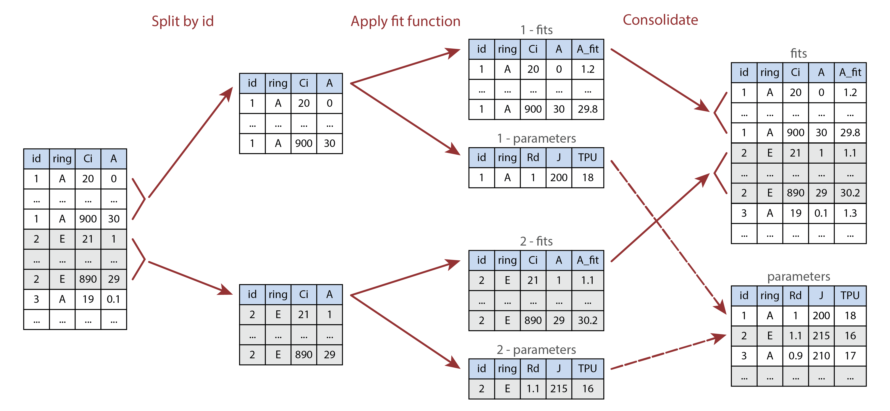

```{r, include = FALSE}
knitr::opts_chunk$set(
  collapse = TRUE,
  comment = "#>",
  fig.width = 4,
  fig.height = 4,
  echo = FALSE,
  results = 'asis',
  eval.after = "fig.cap"
)

advice <- function(include_prefix, advice_text) {
  if (include_prefix) {
    cat(paste0(' > *', advice_text, '*'))
  } else {
    cat(paste(' -', advice_text, '\n\n'))
  }
}

INCLUDE_PREFIX <- TRUE
```

```{css, echo = FALSE}
p.caption {
  font-size: 0.8em;
}
```

# Overview

When performing gas exchange experiments, measurements of variables like $A_n$,
$C_i$, and $g_{sw}$ are not the only important pieces of data to record--it's
also crucial to include information about the particular plant that is being
measured, such as its species or treatment group. Such descriptive data is a
type of *metadata*, which
[is defined as](https://www.merriam-webster.com/dictionary/metadata)
"data that provides information about other data."

Through the "User Constant" interface, Licor LI-6800 instruments provide a way
to include user-defined descriptive metadata in log files, alongside the
measured values that are always recorded. When used effectively, Licor user
constants can be a convenient way to keep track of metadata, helping to
streamline your data analysis workflow.

Simply put, including user constants in your data will make processing and
analyzing the data much easier. There are two main situations where user
constants can help:

1. Applying an operation to every curve in a data set. This approach can be used
   to automate processing steps such as curve fitting. The image below shows how
   a curve identifier (a type of metadata that can be stored as a user constant,
   or determined from the values of other user constants) can be used for this
   purpose.

2. Performing statistical operations to compare results across groups. Following
   the example in the image below, this could entail running a _t_-test to check
   for signficiant differences in _J_ between rings.

Short examples of these applications can be found below in the
[Examples of User Constant Applications] section, and additional examples
can be found throughout the PhotoGEA documentation, such as the
[Analyzing C3 A-Ci Curves](analyzing_c3_aci_curves.html) vignette.

```{r, fig.cap = caption, out.width = '95%', echo = FALSE, results = 'markup'}
caption <-
  'Illustration of processing multiple parts of a table using `by` and
  `consolidate`. Here, `id` and `ring` are user constants, where the `id` column
  identifies each individual curve, and the `ring` value indicates whether each
  leaf was grown under ambient (A) or elevated (E) carbon dioxide conditions.
  The processing function fits a single A-Ci curve and returns a list of two
  tables called `fits` and `parameters`.'


```

The first two sections of this vignette provide key advice about how to set up
user constants and what they can be used for:

- [Choosing User Constants] -- Advice for choosing pieces of metadata to record,
  including examples.

- [Using User Constants] -- Advice for setting up user constants for
  measurements.

The later sections include more information about a few related topics:

- [Examples of User Constant Applications] -- A few short examples of using
  user constants when processing and analyzing data, building off the brief
  overview above.

- [Using File Names or Log Remarks] -- A discussion of alternatives to user
  constants; this section illustrates why user constants are generally simpler
  and easier.

- [How To Deal With Files That Have No Metadata] -- A discussion of what to do
  with log files where user constants, file names, or log remarks were not
  used to record metadata.

Throughout this vignette, key pieces of advice will be shown in italics. The
final section in the vignette
([Summary of Advice for Using Licor LI-6800 User Constants]) contains a list of
all such pieces of advice.

Although this vignette is specialized for Licor LI-6800 instruments, other gas
exchange systems have similar ways to record user constants, so most of the
advice here is general, even if particular details may change with other
instruments. This advice is also specialized for measuring response curves, but
we will sometimes mention other considerations that may apply when making spot
measurements.

Several R examples in this vignette use the the `PhotoGEA` and `lattice`
packages, so we will load them now:

```{r echo = TRUE, results = 'markup'}
library(PhotoGEA)
library(lattice)
```

# Choosing User Constants

Before setting up your user constants through the Licor LI-6800 interface, it is
necessary to decide which pieces of metadata to record. Here are a few
considerations to keep in mind when choosing them:

```{r user_constants_reflect_design}
advice(INCLUDE_PREFIX, 'User constants should generally reflect your
experimental design and the comparisons you eventually plan to make.')
```

For example, if you have a field experiment with two cultivars and two
treatments, it would make sense to include `cultivar` and `treatment` as user
constants.

```{r user_constants_id_curves}
advice(INCLUDE_PREFIX, 'In combination, user constants should uniquely identify
each response curve in your data set.')
```

In the experiment above, if you plan to measure multiple biological replicates
from each cultivar and treatment, then `cultivar` and `treatment` will not
uniquely identify each measurement. In this case it would make sense to also
include a `replicate` user constant.

```{r minimize_user_constants}
advice(INCLUDE_PREFIX, "Don't include too many user constants.")
```

Each user constant takes time and effort to define, and to update during your
measurements. Make sure each one has a clear purpose, and is not redundant
with another user constant.

## Examples of User Constants

Here are a few examples of user constants that have been used by researchers:

- `instrument`, `species`, `plot`, and `replicate`: These were used for field
  measurements of plants from different species, where there were multiple plots
  of each species. Including the "nickname" for each instrument as a user
  constant can make it easy to check for any instrument-specific bias in the
  measurements.

- `machine`, `line`, `sample`, `condition`: These were used for growth chamber
  measurements of plants from different lineages that were grown under different
  temperature conditions. Here, `sample` is an ID number that plays the same
  role as `replicate` in some of the other examples.

- `cultivar`, `plot`, `leaf_type`: These were used for field measurements of
  plants from different cultivars that were arranged in several plots. For each
  plot, two different leaf types (sunlit and shaded) were measured.

- `instrument`, `plant_id`: This is a very minimal example that is sufficient
  to uniquely identify each curve in the set. Here, the researcher was using a
  randomized block design in a greenhouse experiment, where each plant ID
  consisted of a block number and a genotype, formatted like `block - genotype`.
  It is possible to extract the block and genotype information from this ID, but
  it probably would have been easier to use separate user constants for `block`
  and `genotype` instead of a single `plant_id`. See the
  [Using File Names or Log Remarks] section for more details about extracting
  components of a multi-part identifier.

# Using User Constants

In practical terms, there are three main steps involved with using Licor LI-6800
user constants:

1. Defining the user constants
2. Choosing logging options
3. Setting values of the user constants

These will be discussed in the following three sections.

## Defining the User Constants

The "LI-6800 Operating Instructions" includes
[a section about defining user constants](https://www.licor.com/support/LI-6800/topics/constants-tab.html#User).
This is a great place to start, but it's missing some important practical
details:

```{r define_before_opening}
advice(INCLUDE_PREFIX, 'User constants must be defined before opening a log
file.')
```

The user constants will (potentially) be included as columns in the log file,
so so they must be defined before opening a log file. They can be defined
during warmup tests, which is a good time to get them sorted out.

```{r retained_definitions}
advice(INCLUDE_PREFIX, 'User constant definitions are retained by each machine
between uses.')
```

Just like environmental settings (such as humiditity, temperature, or light),
user constant definitions are retained when a log file is closed and when the
machine is powered off. So, when you first start using a machine, you may see
user constant definitions from the previous experiment it was used for. Just
go ahead and replace these with your own definitions.

```{r include_as_columns}
advice(INCLUDE_PREFIX, 'Always log user constants as columns, not as rows.')
```

Logging the user constants as rows breaks up the main data table in the log
file. A basic expectation for a table is that each row represents a set of
observations of each column. This is no longer true when user constants are
logged as rows, which makes the table difficult to process.

```{r do_not_reset}
advice(INCLUDE_PREFIX, 'Never reset after logging.')
```

When the "reset to default after logging" option is selected, the value of the
user constant will change to its default after _a single log_. If you are
running a response curve, this means that the first row in the curve will have
the desired value of the user constant, and then the remaining rows will have
the default value. This is confusing. Potentially, it could be acceptable to
"reset to default after logging" when making spot measurements, but even in
this case it is not clear what the benefit of resetting would be.

```{r computed_variable}
advice(INCLUDE_PREFIX, 'It is rare to need a computed variable.')
```

Computed variables are almost never needed. The only exception is if you want
to see the value of a variable that is not included in a typical log file,
such as the Ball-Berry index (when measuring Ball-Berry curves).

```{r consistent_spelling}
advice(INCLUDE_PREFIX, 'Be consistent with spelling, capitalization, and spacing
across machines and replicates.')
```

If you are using multiple machines for a single experiment and plan to
eventually combine data from each separate log file, it is important to use
consistent spelling and capitalization across the user constant definitions.
For example, if one machine has a user constant called `Species` and another
has `species`, R will not identify these as being the same column when reading
log files.

```{r consider_dropdown}
advice(INCLUDE_PREFIX, 'Consider using a dropdown menu.')
```

For user constants with simple values, setting values with the keyboard/number
pad is the best choice. For example, if the `replicate` user constant will
only take numeric values `1` through `5`, then this would be easy to enter
using the keyboard. However, sometimes values are more complicated; for
example, the `construct_id` user constant might take values `h1na`, `zg5b`,
and `WT`. In this case, spelling these out would be tedious and error-prone,
and it would be better to use a dropdown menu instead of the keyboard.

```{r consider_config}
advice(INCLUDE_PREFIX, 'Consider using a configuration file to define user
constants.')
```

User constant definitions can be saved to a
[configuration file](https://www.licor.com/support/LI-6800/topics/startup-tab.html#Configuration),
which can then be transferred to a USB stick. From there, the configuration
file can be copied to other machines, and the definitions can be loaded. This
can save time and help ensure that user constants use consistent spelling and
capitalization across all machines.

## Choosing Logging Options

The "LI-6800 Operating Instructions" includes
[a section about logging options](https://www.licor.com/support/LI-6800/topics/constants-tab.html#User).
One of the logging options pertains to user constants.

```{r prompts}
advice(INCLUDE_PREFIX, 'It is rare to prompt on manual logs.')
```

When the "prompt on (manual) logs" option is selected, a prompt window will
appear after making a manual log; the prompt will allow you to enter values of
each user constant. When measuring response curves, manual logs are rarely
made, so there is no strong reason to use this option. It may be helpful when
making spot measurements, though.

## Setting Values of the User Constants

The values of user constants can be set or changed at any time after the
constants themselves are defined. To do this, first make sure that the
"Edit/Reorder" checkbox is not selected. Then, simply click on a user constant;
a window will appear where you can type the new value or select it from a
dropdown menu.

If all the user constants are set to log as columns, each row in the log file
will contain the current value of each user constant. If none of the user
constants are set to "reset to default," then their values will remain at the
values you have specified until you change them.

```{r user_constant_routine}
advice(INCLUDE_PREFIX, 'Make user constants part of your measurement routine.')
```

Before clamping on to a new leaf, it is a good idea to double check the
environment variables, and to update user constants so they accurately
describe the new leaf. Make sure both of these steps are part of your
measurement routine. The machine itself will not automatically remind you to
update user constant values.

```{r use_a_backup}
advice(INCLUDE_PREFIX, 'Record metadata in a second place.')
```

User constants are a convenient way to ensure that your important metadata is
stored alongside the gas exchange data itself. However, it's easy to make
mistakes in field conditions, and sometimes you will forget to update user
constants when clamping a new leaf or starting a new curve. As an "insurance
policy," it is wise to record the metadata in a second place, typically a
paper lab notebook. In the paper record, just indicate the sequence of samples
that each machine measures throughout the day. This will enable you to correct
any errors in the user constants.

# Examples of User Constant Applications

## Applying an Operation to Every Curve in a Data Set

We often want to apply an operation to every response curve in a data set. This
could be something relatively simple, such as plotting $A_n$ values against
$C_i$ values, or something more complicated, such as fitting the
Farquhar-von-Caemmerer-Berry model to estimate the values of key photosynthetic
parameters. In all such cases, a prerequisite is that we must be able to
identify each curve in the set.

User constants help to achieve this. For example, if every curve in the set can
be identified by its unique values of the `species` and `plot` columns, then we
can define a new `curve_identifier` column by combining the values of
`species` and `plot`. Then, we can use this column to split the set into chunks
representing individual curves, and apply an operation to each chunk.

Here is an example using a Licor log file that is included with the PhotoGEA
package. When this file was created, the researcher specified the values of
user constants called `species` and `plot`. The file contains several Ball-Berry
curves, which are a special type of light response curve intended to be fit
using the Ball-Berry model:

```{r echo = TRUE, results = 'markup'}
# Read an example Licor file included in the PhotoGEA package
licor_file <- read_gasex_file(
  PhotoGEA_example_file_path('ball_berry_1.xlsx')
)

# Create a `curve_identifier` column based on the `species` and `plot` columns
licor_file[, 'curve_identifier'] <- paste(
  licor_file[, 'species'],
  licor_file[, 'plot']
)

# Plot A vs. Qin for each curve in the data set
xyplot(
  licor_file[, 'A'] ~ licor_file[, 'Qin'] | licor_file[, 'curve_identifier'],
  type = 'b',
  pch = 16,
  xlab = 'Qin (micromol / m^2 / s)',
  ylab = 'A (micromol / m^2 / s)'
)

# Get the number of measured points in each curve
by(
  licor_file,
  licor_file[, 'curve_identifier'],
  nrow
)

# A more complex example: apply the `fit_ball_berry` function to each curve
licor_file <- calculate_total_pressure(licor_file)
licor_file <- calculate_gas_properties(licor_file)
licor_file <- calculate_ball_berry_index(licor_file)

bb_results <- consolidate(by(
  licor_file,
  licor_file[, 'curve_identifier'],
  fit_ball_berry
))
```

## Performing Statistical Operations

All fitting functions in PhotoGEA will preserve user constants in their outputs,
which makes it easy to perform statistical operations on the resulting parameter
estimates. Continuing with the example above, we can calculate the mean
Ball-Berry intercept for each species or plot the mean Ball-Berry slope:

```{r echo = TRUE, results = 'markup'}
# Get the Ball-Berry parameter estimates
bb_parameters <- bb_results$parameters

# Calculate mean Ball-Berry intercept for each species
by(
  bb_parameters,
  bb_parameters[, 'species'],
  function(x) {
    mean(x[, 'bb_intercept'])
  }
)

# Make barchart of mean Ball-Berry slope for each species
barchart_with_errorbars(
  bb_parameters[, 'bb_slope'],
  bb_parameters[, 'species'],
  ylim = c(0, 8),
  ylab = 'Ball-Berry slope (dimensionless)'
)
```

This is a very simple example with a simple data set. More realistic examples
could perform stats tests or compute ANOVA tables.

# Using File Names or Log Remarks

Besides user constants, there are other methods for digitally storing metadata.

Perhaps the simplest approach is to include only one response curve in each
file, and use the file name to store the metadata. For example, the file name
could be formatted like `YYYY-MM-DD species plot replicate.xlsx`.

Another option is to use
[log remarks](https://www.licor.com/support/LI-6800/topics/log-files-tab.html#Logremark),
which are free-form text rows saved in the log file. Remarks are intended for
comments such as "Wow, this plant looks terrible," but they can be repurposed to
store metadata. Following the example above, the remark message could be
something like `species plot replicate`.

A downside to these approaches is that they only provide one field for storing
the metadata. In other words, in the examples above, instead of creating
separate columns for `species`, `plot`, and `replicate`, these approaches would
create a single description of all three together. If you want to later extract
the individual `species`, `plot`, and `replicate` values, it will be necessary
to ["parse"](https://en.wikipedia.org/wiki/Parsing) the combined text string.

```{r avoid_filenames_and_remarks}
advice(INCLUDE_PREFIX, 'User constants save time in the long run compared to
storing metadata in file names or remarks.')
```

Because of the "parsing issue," it's generally simpler and more time-efficient
to just make separate user constants for each important piece of metadata.
Although it's often simple for a human to parse a string, it can be difficult
for a computer.

There is no general way to parse a string, but we discuss a few options below.

## Automated Parsing Using R

Automated parsing can sometimes be accomplished in R with some combination of
the `strsplit`, `grep`, and `gsub` functions.

Here is an example using `strsplit`:

```{r echo = TRUE, results = 'markup'}
# Set up a hypothetical user remark formatted like "species plot replicate"
remark_message <- 'maize 2 3'

# We can split this message into components that are separated by spaces
split_remark_message <- strsplit(remark_message, split = ' ')
str(split_remark_message)

# Then we can identify each component of the split message
species   <- split_remark_message[[1]][1]
plot      <- split_remark_message[[1]][2]
replicate <- split_remark_message[[1]][3]

str(list(species = species, plot = plot, replicate = replicate))
```

It's easy to imagine scenarios where this approach to parsing will fail. For
example, suppose a typo was made when making the remark, and it was written as
`maize2 3`. Let's see what happens:

```{r echo = TRUE, results = 'markup'}
# Set up a hypothetical user remark with a typo
remark_message <- 'maize2 3'

# We can split this message into components that are separated by spaces
split_remark_message <- strsplit(remark_message, split = ' ')

# Then we can identify each component of the split message
species   <- split_remark_message[[1]][1]
plot      <- split_remark_message[[1]][2]
replicate <- split_remark_message[[1]][3]

str(list(species = species, plot = plot, replicate = replicate))
```

Similar issues would occur if some of the remark components were separated by
dashes instead of spaces. Because of issues like this, automated parsing can
sometimes be very difficult and complex. Even just detecting when spaces or
dashes are used can require a lot of code, as can be seen in
[this example](https://github.com/eloch216/PhotoGEA/blob/04b7dff7638b5be4069a16ff8d6507fdd61b6542/example_scripts/gm_from_tdl.R#L173-L239).

If there are just a few mistakes with the remarks, they can be manually fixed by
editing the log files before reading them. However, there is no limit to the
number of formatting issues that could potentially occur. You may think you can
perfectly follow a clear format for all of your remarks, but everyone makes
mistakes.

## Manual Parsing Using R

It is possible to side-step the complexities of automated parsing by using code
that manually sets the values of individual metadata variables based on the
value of the file name or user remark. For example, continuing the example
above, we could do something like the following:

```{r echo = TRUE, results = 'markup'}
if (remark_message == 'maize2 3') {
  species   <- 'maize'
  plot      <- 2
  replicate <- 3
}

str(list(species = species, plot = plot, replicate = replicate))
```

When interpreting many different file names or remarks, this alternative to
parsing can be streamlined a bit by using PhotoGEA's `set_variable` function,
but it will always be tedious. Here's an example of how this could be done:

```{r echo = TRUE, results = 'markup'}
# Say we have a data frame of spot measurements that also includes user remarks
# with inconsistent formatting
licor_data <- data.frame(
  A = c(1.1, 1.2, 1.3, 1.4, 1.5),
  Ci = c(291, 292, 293, 294, 295),
  user_remark = c('maize 2 3', 'maize-1 4', 'soybean3 1', 'maiz 5 6', '3 2 soybean')
)

print(licor_data)

# Now we can manually parse the remarks using `set_variable`
licor_data <- set_variable(
  licor_data,
  'species',
  id_column = 'user_remark',
  value_table = list(
    `maize 2 3`   = 'maize',
    `maize-1 4`   = 'maize',
    `soybean3 1`  = 'soybean',
    `maiz 5 6`    = 'maize',
    `3 2 soybean` = 'soybean'
  )
)

licor_data <- set_variable(
  licor_data,
  'plot',
  id_column = 'user_remark',
  value_table = list(
    `maize 2 3`   = 2,
    `maize-1 4`   = 1,
    `soybean3 1`  = 3,
    `maiz 5 6`    = 5,
    `3 2 soybean` = 3
  )
)

licor_data <- set_variable(
  licor_data,
  'replicate',
  id_column = 'user_remark',
  value_table = list(
    `maize 2 3`   = 3,
    `maize-1 4`   = 4,
    `soybean3 1`  = 1,
    `maiz 5 6`    = 6,
    `3 2 soybean` = 2
  )
)

print(licor_data)
```

## Manual Parsing Using Excel

```{r manual_parsing_with_excel}
cat("If you are working with Excel log files, it's also possible to manually add
new columns for the individual metadata variables, and fill them in with the
appropriate values. This can be time-consuming and tedious, especially if you
have many files to process, but sometimes it might be the best option.")
```

# How To Deal With Files That Have No Metadata

Sometimes you may find yourself working with files that do not contain any
helpful metadata in the form of user constants or remarks, or even in the
file names. Don't worry -- there are ways to deal with this situation, as long
as the metadata is available _somewhere_.

## Adding Metadata in R

It may require some creativity, but there is usually a way to add a basic curve
identifier to a data set in R.

For example, suppose the files contain response curves that all have 17 points.
In these files, observations 1--17 will constitute one curve, observations
18--34 will constitute the next curve, and so on. In this case, the following
code could be used to add a curve identifier column based on the file name and a
sequential curve number:

```{r echo = TRUE, results = 'markup', eval = FALSE}
# Specify the number of points in each curve
pts_in_curve <- 17

# Create a new identifier column formatted like `file_name - curve_number`
licor_data[, 'curve_identifier'] <- paste(
  tools::file_path_sans_ext(basename(licor_data[, 'file_name'])),
  ceiling(licor_data[, 'obs'] / pts_in_curve),
  sep = ' - '
)
```

Of course, this code may have some problems if some curves have different
numbers of points, or if a manual log was accidentally made (so that the values
of `obs` don't line up properly). That's why creativity may be required.

Once the basic curve identifier has been added, values of metadata can be added
following the `set_variable` strategy described in the [Manual Parsing Using R]
section.

## Adding Metadata in Excel

```{r}
<<manual_parsing_with_excel>>
```

# Summary of Advice for Using Licor LI-6800 User Constants

```{r}
INCLUDE_PREFIX <- FALSE

<<user_constants_reflect_design>>

<<user_constants_id_curves>>

<<define_before_opening>>

<<retained_definitions>>

<<include_as_columns>>

<<do_not_reset>>

<<computed_variable>>

<<consistent_spelling>>

<<consider_dropdown>>

<<consider_config>>

<<prompts>>

<<user_constant_routine>>

<<use_a_backup>>

<<avoid_filenames_and_remarks>>
```
