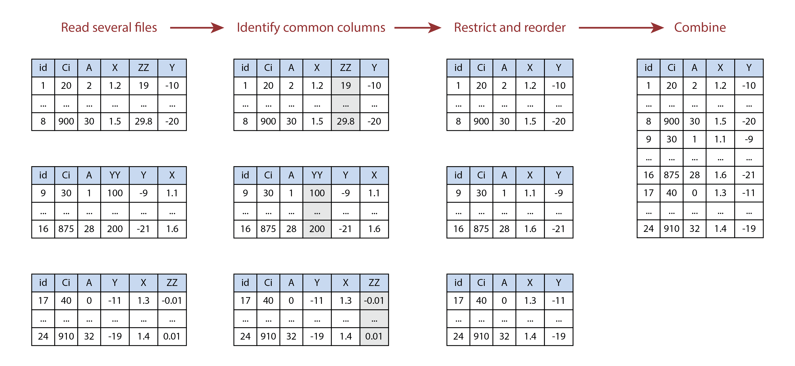
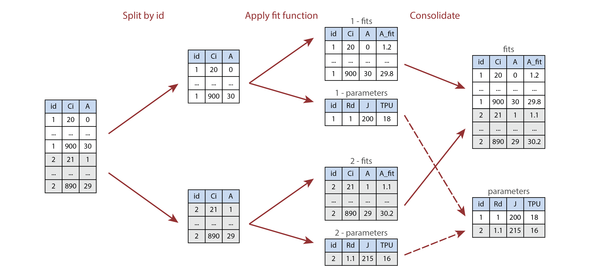

```{r, include = FALSE}
knitr::opts_chunk$set(
  collapse = TRUE,
  comment = "#>",
  fig.width = 7,
  fig.height = 5,
  fig.align = "center",
  eval.after = "fig.cap"
)
```

```{css, echo = FALSE}
p.caption {
  font-size: 0.8em;
}
```

# Overview

The *extended data frame* (abbreviated as `exdf`) class is a special data
structure defined by the `PhotoGEA` package. In many ways, an `exdf` object is
equivalent to a data frame, with the major difference being that an `exdf`
object includes the units and "category" of each column. The `exdf` class was
originally created as a way to represent the contents of a Licor Excel file in
an R structure. In Licor Excel files, the data is arranged in a table where each
column has a name, units, and a category; for example, the column for values of
net assimilation rate is called `A`, has units of `micromol / m^2 / s`, and is
categorized as a `GasEx` variable.

```{r, fig.cap = exdf_caption, out.width = '95%', echo = FALSE}
exdf_caption <-
  'Illustration comparing data frames (left) to extended data frames (right).'

knitr::include_graphics('images/exdf_illustration.png')
```

Because `exdf` objects keep track of the units for each column, functions acting
on `exdf` objects are able to check that important variables have the correct
units, ensuring that the output they produce is correct. Additionally, the
category for each column can be used to store other important information about
it, such as the function that was used to calculate its values. For example, the
`calculate_ball_berry_index` function takes an `exdf` object as an input and (1)
checks whether the net assimilation, relative humidity, and CO~2~ concentration
columns of the object have the expected units, (2) adds a new column containing
values of the Ball-Berry index, and (3) uses the category of the new column to
indicate it was calculated by `calculate_ball_berry_index`.

Thus, `exdf` objects provide a clear method for ensuring that requirements about
units are met before making calculations and for retaining a record of how the
values of new columns were calculated. Because of these important properties,
nearly all functions in the `PhotoGEA` package create or modify `exdf` objects
rather than regular data frames. In the following sections, this vignette will
demonstrate how to create `exdf` objects, extract information from them, and
modify their contents.

_Note_: here, we will assume that you have some basic familiarity with common R
data structures like lists, vectors, and data frames. If you are unfamiliar with
these, it may be helpful to consult with another online guide or tutorial such
as the [Data Structures](http://adv-r.had.co.nz/Data-structures.html) chapter
from _Advanced R_.

# Loading Packages

As always, the first step is to load the packages we will be using. In addition
to `PhotoGEA`, we will also use the `lattice` package for generating plots.

```{r setup}
# Load required packages
library(PhotoGEA)
library(lattice)
```

If the `lattice` package is not installed on your R setup, you can install it by
typing `install.packages('lattice')`.

# Basic Properties of an Extended Data Frame

From a technical point of view, an `exdf` object is simply an R list with the
following properties:

- It must contain elements named `main_data`, `units`, and `categories`.
- Each of these required elements must be a data frame.
- Each of these required elements must have the same column names, which can be
  thought of as the column names for the `exdf` object as a whole.
- The `units` data frame must contain just one row, whose values specify the
  units for each column.
- The `categories` element must have one row containing the category of each
  column.
- The `main_data` data frame can have any number of rows and contains the main
  data of the `exdf` object.

The function `is.exdf` can be used to check whether any R object is an extended
data frame. By default, it performs a simple check on the information returned
by the `class` function, but it also has an option to perform a more detailed
check of each requirement listed above. For more information, type `?is.exdf` in
the R terminal to access the help menu entry for `is.exdf`.

Besides these three required elements, it is also possible for an `exdf` object
to have additional entries such as a `filename` that stores the name of the file
that was used to create the `exdf`. There are no restrictions on the types of
these "extra" elements; they could be numeric values, strings, vectors, data
frames, other lists, etc. Of course, they should not be named `main_data`,
`units`, or `categories`.

# Creating Extended Data Frames

There are three main ways to create an `exdf` object:

- From three separate data frames specifying the main data, units, and
  categories of the new `exdf` object.
- From a single data frame representing the main data of the new `exdf` object;
  in this case, units and categories will be initialized to `NA`.
- From a data file such as a Licor Excel file or a tunable diode laser (TDL)
  output file.

In the following sections, we will demonstrate each of these methods.

## Specifying Main Data, Units, and Categories

As an example of the first method, we will create an extended data frame called
`exdf_1` with two columns named `A` and `B`. These two columns will have units
of `m` and `s` and categories of `Cat1` and `Cat2`, respectively.

```{r}
exdf_1 <- exdf(
  data.frame(A = c(3, 2, 7, 9), B = c(4, 5, 1, 8)),
  data.frame(A = 'm', B = 's'),
  data.frame(A = 'Cat1', B = 'Cat2')
)
```

We can view a nicely-formatted version of the object using the `print` command:

```{r}
print(exdf_1)
```

Notice that each column descriptor in the printed version is formatted as
`name [category] (units)`.

## Initializing with Default Units and Categories

As an example of the second method, we will create an extended data frame called
`exdf_2` with two columns named `A` and `B`, but we won't specify their units or
categories.

```{r}
exdf_2 <- exdf(data.frame(A = c(3, 2, 7, 9), B = c(4, 5, 1, 8)))
```

As before, we can `print` the data frame:

```{r}
print(exdf_2)
```

The units and categories have been initialized to default values of `NA`, but we
can supply new units and categories using the `document_variables` function:

```{r}
exdf_2 <- document_variables(exdf_2, c('Cat1', 'A', 'm'), c('Cat2', 'B', 's'))
```

Now `exdf_2` is identical to `exdf_1`:

```{r}
identical(exdf_1, exdf_2)
```

Sometimes this method is more convenient than the previous one.

## Reading From an Instrument Log File

As an example of the third method, we will create an extended data frame from a
Microsoft Excel file containing Licor measurements.

```{r}
exdf_3 <- read_gasex_file(
  PhotoGEA_example_file_path('ball_berry_1.xlsx')
)
```

This new object has many columns and rows, so we won't print it here. However,
we can confirm that it is indeed a properly-defined `exdf` object:

```{r}
is.exdf(exdf_3, TRUE)
```

# Writing to and Reading From CSV Files

Any `exdf` object can be saved to a CSV file using the `write.csv.exdf`
function. For example, the Licor log file discussed above can be saved to a CSV
file as follows:

```{r, eval = FALSE}
write.csv.exdf(exdf_3, file = 'ball_berry_1.csv')
```

CSV files created using `write.csv.exdf` can be read later using
`read.csv.exdf`, which will create an `exdf` object from the information in the
file. For example, the CSV file created with the last command can be read as
follows:

```{r, eval = FALSE}
exdf_4 <- read.csv.exdf('ball_berry_1.csv')
```

Writing an `exdf` to a CSV file and then reading it again preserves all of its
information, including categories, units, and column names. Because of this, the
`exdf_4` should be identical to `exdf_3`.

# Extracting Information from Extended Data Frames

There are three main ways to extract information from an extended data frame:

- The "top-level" elements such as `main_data` and `units` can be directly
  accessed.
- Columns or other subsets of the `main_data` element can be accessed.
- An extended data frame with a subset of the original data can be obtained.

In the following sections, we will demonstrate each of these possibilities. They
are also described in a help page that can be accessed from within R by typing
`?extract.exdf`.

## Accessing Top-Level Elements

Because an extended data frame is technically just a list, its "top-level"
elements can be viewed using `names`, `$`, and `[[`. For example, all of the
top-level elements can be retrieved using `names`:

```{r}
names(exdf_1)

names(exdf_3)
```

Here we see that both `exdf` objects have the three required elements:
`main_data`, `units`, and `categories`. `exdf_3` has a few "extra" elements that
were automatically created by the `read_gasex_file` function. Any of these
top-level elements be accessed by name using the `$` and `[[` operators:

```{r}
exdf_1$units

exdf_3[['file_name']]
```

## Accessing The Main Data Frame

When `colnames` or the `[` operator are applied to an `exdf` object, they act
directly on the object's `main_data` element. For example, the following
commands are equivalent ways to access the column names of `exdf_1`:

```{r}
colnames(exdf_1)

colnames(exdf_1$main_data)
```

Likewise, the following commands are equivalent ways to extract the `A` column
from `exdf_1` as a vector:

```{r}
exdf_1[, 'A']

exdf_1$main_data[, 'A']

exdf_1$main_data$A
```

It is usually preferable to apply these functions to the `exdf` object rather
than its `main_data` element since the resulting code is cleaner.

## Creating a Subset

Sometimes it is necessary to extract a subset of an `exdf` object. For example,
we may wish to extract just the rows from `exdf_1` where the value of the `A`
column is greater than 5, keeping all the columns. This can be accomplished as
follows, using a syntax that is nearly identical to the syntax of extracting a
subset of a data frame:

```{r}
exdf_1[exdf_1[, 'A'] > 5, , return_exdf = TRUE]
```

Here it is critical to specify `return_exdf = TRUE`; otherwise, the command will
instead return a subset of the `exdf` object's `main_data` element, as discussed
in [Accessing The Main Data Frame]:

```{r}
is.exdf(exdf_1[exdf_1[, 'A'] > 5, , TRUE])

is.data.frame(exdf_1[exdf_1[, 'A'] > 5, ])
```

# Modifying Extended Data Frames

As is the case with extracting information, it is possible to modify the
"top-level" elements of an `exdf` object as well as the contents of its
`main_data`. The following sections provide examples of both types of
operations.

## Modifying Top-Level Elements

Top-level elements can be added or modified using `[[<-` and `$<-` as with any
list. As an example, we will change the `file_name` element of `exdf_3` and add
a new top-level element:

```{r}
exdf_3$file_name <- 'new_file_name.xlsx'

exdf_3[['new_element']] <- 5
```

We can confirm the changes:

```{r}
exdf_3$file_name

exdf_3$new_element
```

## Modifying the Main Data

The contents of the `main_data` of an `exdf` object can be modified using the
`[<-` operator. For example, we could add 1 to each value in the `A` column of
`exdf_2`:

```{r}
exdf_2[, 'A'] <- exdf_2[, 'A'] + 1
```

We could also add a new column called `C`:

```{r}
exdf_2[, 'C'] <- 7
```

In this case, the units and category of the new column will be initialized to
`NA`:

```{r}
print(exdf_2)
```

The units and category of the new column can be modified later with
`document_variables` as in [Initializing with Default Units and Categories].

Alternatively, the `set_variable` function can be used to set the value, units,
and category of a column in an extended data frame in one step. Here we use this
function to add a new column called `D` with units of `kg` and category `cat4`
whose value is 20:

```{r}
exdf_2 <- set_variable(exdf_2, 'D', 'kg', 'cat4', 20)

print(exdf_2)
```

The `set_variable` function also has more advanced abilities to set separate
values of a column for different subsets of an extended data frame; for more
information, see its help menu entry by typing `?set_variable`.

**Important note**: It is generally a bad idea to directly modify `main_data`
because this can cause problems. For example, we could try adding another new
column called `E` using the following code:

```{r}
exdf_2$main_data$E <- 17
```

Now, `exdf_2` is no longer a properly defined `exdf` object because there is a
`E` column in `exdf_2$main_data` that is not present in `exdf_2$units` or
`exdf_2$categories`. This may prevent other functions from working properly; for
example, `print` will not properly display the `E` column. This is a subtle
problem that can only be detected using `is.exdf` with `consistency_check` set
to `TRUE`:

```{r}
print(exdf_2)

is.exdf(exdf_2)

is.exdf(exdf_2, TRUE)
```

# Common Patterns

Here will we explain a few common ways that `exdf` objects are created,
modified, or otherwise used.

## Combining Data From Several Files

It is quite common for one data set to be spread across multiple data files; for
example, if multiple Licors are used to measure response curves from a set of
plants, there will be one data file for each machine. On the other hand, the
data is much easier to process and analyze if it is stored in a single `exdf`
object. Thus, it is common to take the following steps in a script:

1. Define a vector of file names that identify the files to be loaded.
2. Use `lapply` and `read_gasex_file` to load each file, producing a `list` of
   `exdf` objects.
3. Identify common columns using `identify_common_columns`; in other words,
   determine which columns are present in each of the `exdf` objects.
4. Limit each `exdf` object to just the common columns using the `[` operator
   with `return_exdf` set to `TRUE`.
5. Use `rbind` to combine the `exdf` objects into a single `exdf` containing the
   data from all of the files.

In this process, steps 3 and 4 are required because `exdf` objects cannot be
combined with `rbind` if they have different columns. This way of combining can
be visualized as stacking tables on top of each other vertically, and it only
makes sense if they all have the same columns. It is common for Licor files to
have some differences between their columns, so these steps are usually
necessary. Even if all the files *do* have the same columns, taking these steps
will not cause any issues, so there's no harm in always doing this. The
following image illustrates this process visually for a set of three files.

```{r, fig.cap = loading_caption, out.width = '95%', echo = FALSE}
loading_caption <-
  'Illustration of combining multiple tables using `identify_common_columns` and
  `rbind`. In this example, the `YY` and `ZZ` columns are not present in all of
  the tables, so they are removed before the tables are vertically stacked.'


```

The following is an example of code that accomplishes these steps:

```{r}
# Define a vector of paths to the files we wish to load
file_paths <- c(
  PhotoGEA_example_file_path('ball_berry_1.xlsx'),
  PhotoGEA_example_file_path('ball_berry_2.xlsx')
)

# Load each file, storing the result in a list
licor_exdf_list <- lapply(file_paths, function(fpath) {read_gasex_file(fpath)})

# Get the names of all columns that are present in all of the Licor files
columns_to_keep <- do.call(identify_common_columns, licor_exdf_list)

# Extract just these columns
licor_exdf_list <- lapply(licor_exdf_list, function(x) {
  x[ , columns_to_keep, TRUE]
})

# Use `rbind` to combine all the data
licor_data <- do.call(rbind, licor_exdf_list)
```

This pattern (where files are loaded, truncated to common columns, and then
combined) is found in most analysis scripts, such as the one in the
[Analyzing Ball-Berry Data](analyzing_ball_berry_data.html) vignette.

Now that the data from the files has been combined into one `exdf` object, it's
easy to perform calculations on all of it at once. For example, we can calculate
total pressure, additional gas properties, and the Ball-Berry index:

```{r}
# Calculate the total pressure in the Licor chamber
licor_data <- calculate_total_pressure(licor_data)

# Calculate additional gas properties, including `RHleaf` and `Csurface`
licor_data <- calculate_gas_properties(licor_data)

# Calculate the Ball-Berry index
licor_data <- calculate_ball_berry_index(licor_data)
```

In this example, the vector of files to load was defined manually by typing out
the file names; files can also be selected interactively using the
`choose_input_files`, `choose_input_licor_files`, and `choose_input_tdl_files`
functions.

## Processing Multiple Pieces of an Extended Data Frame

It is common for an `exdf` object to contain data that represents multiple
"chunks," such as response curves, that can each be located using the value of
one or more "identifier" columns like `event`, `replicate`, `species`, etc. In
this scenario, it is often desirable to apply a function, such as a fitting
function, to each chunk in the data set. As a concrete example, the `licor_data`
`exdf` created in [Combining Data From Several Files] contains several
Ball-Berry curves, and the `fit_ball_berry` function applies a fitting procedure
to one curve to determine values for the Ball-Berry parameters. How can we apply
`fit_ball_berry` to each curve in the data in a simple way?

Often the easiest route is to use the `by` function. This function requires
four inputs:

- An `exdf` object containing multiple "chunks" of data.
- One or more vectors whose values can be used to split the `exdf` into chunks.
- A function that should be appled to each chunk.
- Any additional arguments that should be passed to the function.

With this information, `by` will split the `exdf` object into chunks and apply
the function to each one. Its return value will be a list, where each list
element is the output from one function call, as applied to one chunk. For more
information, access the built-in help system entry by typing `?by.exdf`. Here we
show how `by` can be used to apply the Ball-Berry fitting procedure to each
curve in `licor_data`:

```{r}
by_result <- by(
  licor_data,                                          # exdf object
  list(licor_data[, 'species'], licor_data[, 'plot']), # identifier columns
  fit_ball_berry                                       # function to apply to chunks
)
```

The `fit_ball_berry` function returns a list of two `exdf` objects named `fits`
and `parameters`, so the return value from `by` is a complicated object: it is a
list of lists of exdf objects; in other words, a nested list. We can see this
structure as follows:

```{r}
str(by_result, max.level = 2)
```

It would be much easier to work with this information if it were reorganized by
separately combining all of the `fits` and `parameters` elements. Fortunately,
this can be easily done with the `consolidate` function. This function will
collect all of the second-level elements with the same names and combine them
using `rbind`:

```{r}
consolidate_by_result <- consolidate(by_result)
```

We can now see that instead of a nested list, we have a list of two `exdf`
objects:

```{r}
str(consolidate_by_result, max.level = 1)
```

It is common to apply the `consolidate` and `by` functions in the same line to
make the code more concise. Afterwards, the elements from the resulting list can
be separated to make additional analysis easier:

```{r}
ball_berry_result <- consolidate(by(
  licor_data,
  list(licor_data[, 'species'], licor_data[, 'plot']),
  fit_ball_berry,
  'gsw', 'bb_index'
))

ball_berry_fits <- ball_berry_result$fits
ball_berry_parameters <- ball_berry_result$parameters
```

This pattern (where a function is applied to multiple curves using `consolidate`
and `by`) is found in most analysis scripts, such as the one in the
[Analyzing Ball-Berry Data](analyzing_ball_berry_data.html) vignette. The
following image illustrates this process visually.


```{r, fig.cap = processing_caption, out.width = '95%', echo = FALSE}
processing_caption <-
  'Illustration of processing multiple parts of a table using `by` and
  `consolidate`. Here the `id` column is either `1` or `2`, and the processing
  function returns a list of two tables called `fits` and `parameters`.'


```

## Plotting Data From an Extended Data Frame

If an `exdf` object contains multiple curves, it is often convenient to plot
them using the `xyplot` function from the `lattice` package. This plotting tool
makes it easy to put each curve in its own panel, or to group the curves by an
identifier such as `event` or `species`. In this case, it is common to pass the
`main_data` element of an `exdf` object as the `data` argument of
`lattice::xyplot` since it only works with data frames:

```{r}
xyplot(
  gsw ~ bb_index | species,
  group = plot,
  data = licor_data$main_data,
  type = 'b',
  pch = 16,
  auto.key = list(space = 'right'),
  grid = TRUE
)
```

Because `exdf` objects include the units for each column, it is also possible to
add them to the axis labels. This can be accomplished using the `paste0`
function, which can create character strings from the values of variables. For
example, we could create a string describing the `gsw` column as follows:

```{r}
paste0('Stomatal conductance to H2O (', licor_data$units$gsw, ')')
```

These labels can then be included in the plot itself:

```{r}
xyplot(
  gsw ~ bb_index | species,
  group = plot,
  data = licor_data$main_data,
  type = 'b',
  pch = 16,
  auto.key = list(space = 'right'),
  grid = TRUE,
  xlab = paste0('Ball-Berry index (', licor_data$units$bb_index, ')'),
  ylab = paste0('Stomatal conductance to H2O (', licor_data$units$gsw, ')')
)
```

This pattern (where the `main_data` element of an `exdf` object is passed to
`lattice::xyplot` and its `units` element is used to create informative axis
labels) is found in most analysis scripts, such as the one in the
[Analyzing Ball-Berry Data](analyzing_ball_berry_data.html) vignette.

# How To Find More Information

All S3 methods defined for the `exdf` class can be viewed using the `methods`
function:

```{r}
methods(class = 'exdf')
```

However, this does not include all functions related to the `exdf` class. Others
can be identified by typing `??exdf` within the R environment.

Finally, the other vignettes in the `PhotoGEA` package include many examples of
how `exdf` objects can be created and used while analyzing photosynthetic gas
exchange data.
